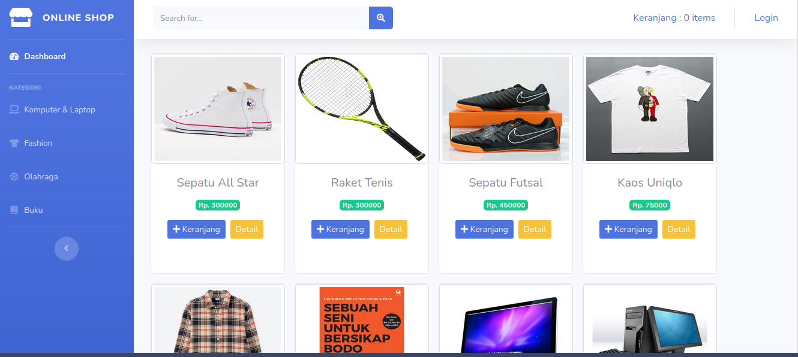
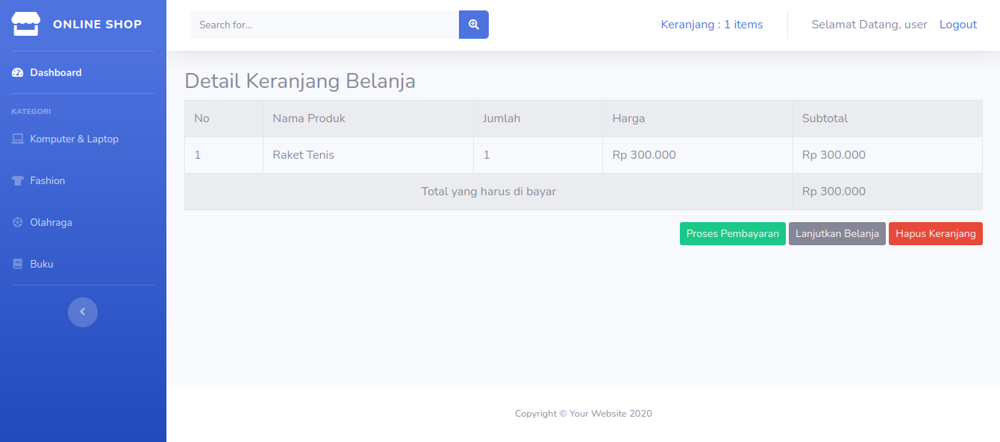
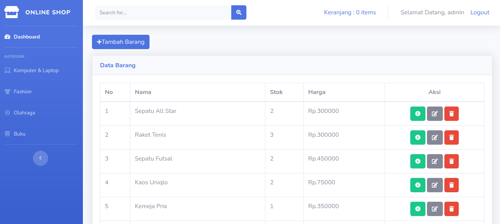
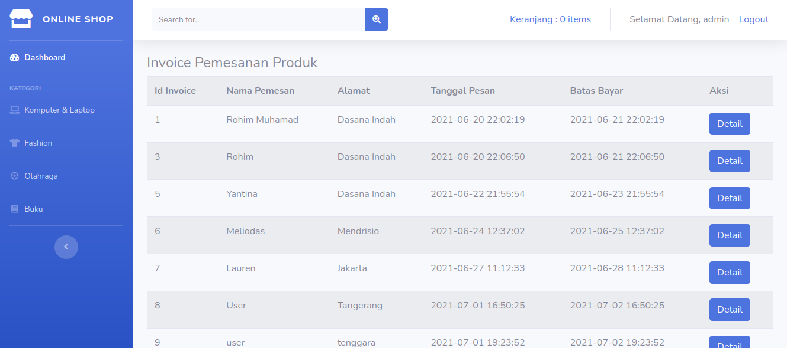

# Aplikasi Toko Online Sederhana

Aplikasi toko online sederhana ini di buat menggunakan framework PHP Codeigniter 3.19 dan Template bootstrap SBAdmin2.

Dibuat demi kepentingan pembelajaran penulis dan masih akan terus diperbaiki dan dikembangkan. 

<table>
<tr>
<td></td>
<td></td>
</tr>
<tr>
<td></td>
<td></td>
</tr>
</table>

# Fitur
1. Login user dan admin
2. Tambah item ke keranjang
3. Invoices 
4. Stok item

# Instalasi

1. `git clone https://github.com/rohimoz28/toko_online.git`
2. Salin folder ke localhost 
3. Import database `toko_online.sql`
4. Buka browser dan ketikkan pada url 
`localhost/toko_online`
5. Login admin username: `admin` pass: `1234`
6. Login user username: `user` pass: `1234`
# Lisensi
Aplikasi toko online sederhana ini bebas digunakan demi kepentingan pembelajaran. 

# Sumber
[Framework Indonesia](https://www.youtube.com/watch?v=3v5fOQWUiuA&list=PLce3Eyp7oY98Kfzlhi25W1fEhcd36SXCY)

[Codeigniter 3.19](https://codeigniter.com/docs)

[Bootstrap 4.16](https://getbootstrap.com/docs/4.6/getting-started/introduction/)

[SBAdmin 2](https://startbootstrap.com/theme/sb-admin-2)